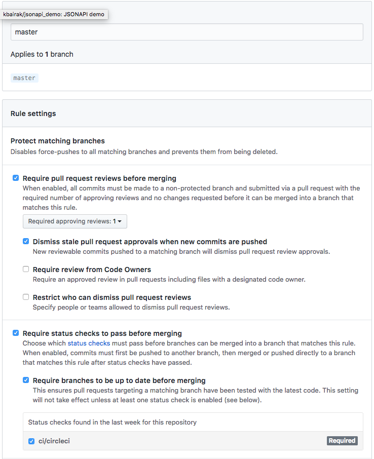

# Repositories

When setting up a new repository, there are a few things we should keep in mind.

## Settings

### Properly defined initial branches

Typically we use `master` and `devel` as the main branches in our repositories. These branches have a special semantic meaning (see details).

### Default base branch

This branch will be the base branch for every newly opened PR. Typically this is `devel`.

### Branch protection rules

We can protect certain branches from actions like force-pushing, merging PRs without approvals and so on. Typically we protect `master` and `devel`, with the following suggested options:

## Readme file

The README file is very important for every person that interacts with the repository. It is most often the first place someone expects to find information in order to understand what a repository is about and how to make use of it.

It should contain:

- a description that is long enough to provide the most important information about the purpose and contents of the repository
- setup/installation instructions
- explanation of the basic features
- examples of use (code, API calls)
- high-level architecture (at least for somewhat complex projects)
- the way to run tests

Essentially, it should contain everything a new developer needs in order to start using or working on a repository.

