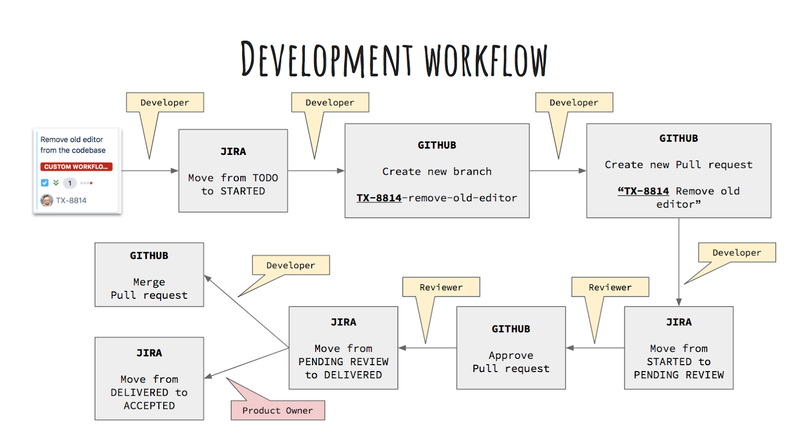

# Ticket handling

## Workflow

It is important that the board is up to date at any time. This is the best, and often the only, tool P.O.s have in order to know where each team stands with everything it’s tackling. Make sure you are always moving the tickets you are handling to the appropriate column depending on their state, as shown in the following diagram.

### Started

**Responsible:** Assignee

Let’s say you are starting working on a ticket.

If you are going to work solo, then you should assign yourself to the ticket on JIRA. This reminds everyone who is working on what. If more than one people are working on the same ticket, then at least one person of the people involved should be assigned (probably the one who started the initial work on the ticket) and the assignee can be updated as work is progressing.

As soon as you start, you should move the ticket to the *Started* column.

As mentioned in the Git section, you should also create a branch whose name has a `TX-####` prefix that matches the ticket id. This activates various automations between JIRA and Github and gives us better tracking of things.

### Pending Review

**Responsible:** Assignee

At some point, you will create a PR for this ticket. Make sure its name starts with the ticket ID (`TX-####`). When the PR is ready with all necessary information, move the ticket from *Started* to *Pending Review*.

### Delivered (or back)

**Responsible:** Reviewer

The reviewer will now take over. If the PR is approved, the reviewer is responsible for moving the ticket to the *Delivered* column.

If the PR is rejected instead, the reviewer is responsible for moving the ticket to Started. When the requested changes are made, you should again move the ticket to Pending Review and ask for a new review. This cycle can be repeated as many times as necessary.

### Merging

**Responsible:** Assignee or Reviewer

After a PR has been approved and the ticket has been moved to Delivered, you can merge the PR, provided that there is no condition that blocks you from doing so (e.g. another PR needs to be merged first on the same or on another repository).

The reviewer can also merge the PR, after first conferring with the assignee and/or getting approval from the P.O. of the team.

### Accepted

**Responsible:** Product Owner

The P.O. will decide if everything about this ticket can be considered finished. In that case, the P.O. will move it to Accepted. Otherwise, the ticket will go back to TODO.

## Comments

Commenting on tickets is reserved for high-level information. Use it to inform the P.O.s, Support, etc of anything significant that might be of interest to them. Technical information should instead go to the corresponding PR(s).

## Definition of Ready

In order for a PBI to be added to a sprint it must contain enough information so that the development team understands what needs to be done in order to deliver the increment.

A PBI is well refined when it conforms to the following **Definition of Ready (DoR)**, thus it is:

- **Independent**, it should be self-contained, in a way that there is no inherent dependency on another PBI
- **Negotiable**, it should leave space for discussion
- **Valuable**, it must deliver value to the stakeholders
- **Estimable**, developers must always be able to estimate its size
- **Small**, it should not be so big as to become impossible to plan/task/prioritize with a certain level of accuracy
- **Testable**, it must provide the necessary information to make test development possible
- **Acceptance criteria** are clearly set, including functionality, documentation updates or a plan for informing the stakeholders

## Definition of Done

All development teams working on the same product should conform to a common Definition of Done (DoD). This ensures that all teams follow the same principles, quality guidelines and practices while delivering increments during a sprint.

However each team should feel free to create a more detailed DoD based on their custom needs, which however should extend and confront to the cross-team DoD, acting as a superset.

Therefore, all teams delivering PBIs should at least conform to the following DoD:

- Acceptance criteria are met
- Code follows TEM style-guide
- Automated regression tests are included
- Code has passed a thorough review
- Increment can be demonstrated
- Increment introduces no security vulnerabilities
